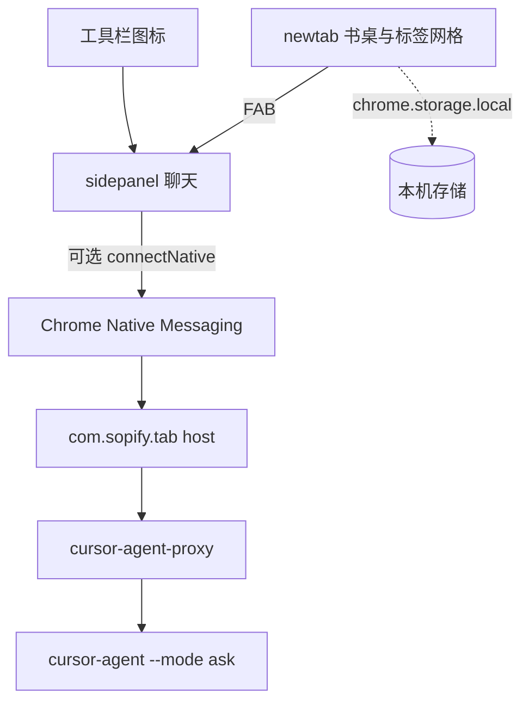

# 技术设计: Sopify Tab 工作台与可选本机 CLI

## 技术方案

- 核心技术: Chrome Manifest V3，Vanilla HTML / CSS / JavaScript；native host 用 Node，由 install 脚本写入绝对路径
- 实现要点:
  - 新标签页只承载书桌和当前窗口标签。Agent 会话活在 Side Panel 文档，避免 `chrome_url_overrides` 卸载把对话一起杀掉。
  - `nativeMessaging` 可选。商店包不带 host。Host JSON 的 `allowed_origins` 只列本扩展稳定 ID。
  - Host 入口必须是可执行文件的绝对路径。本机 `cursor-agent` 是 zsh alias，真实入口是 `/Users/weixin.li/.local/bin/cursor-agent-proxy`。Node 只在 nvm 下，禁止 `/usr/bin/env node`。
  - CLI 合同：`--print --output-format stream-json --mode ask`。cwd 锁定。不传 `--force`。`--mode ask` 不是 OS 沙箱。
  - 关闭 Side Panel：结束 `Port`，并杀掉 host 拉起的整棵进程树。

## 架构设计



目录约定（Wave 1 才创建产品文件）：

```text
sopify-tab/
  extension/     MV3 扩展
  host/          native host 与 install-host.sh
  .sopify/      方案与长期知识
```

消费边界：

- `newtab.*` 不持有 agent 会话，不申请 `nativeMessaging`。
- `sidepanel.*` 持有当次会话 DOM；关文档即停当次运行。
- `background.js` 只做权限、sidePanel 行为、消息转发，不在 service worker 里硬撑长任务。
- `host/` 只在用户安装后存在于本机；CRX 里最多放脚本源码，不把用户机器路径提交进 git（`host/local-paths.json` 已进 `.gitignore`）。

## 安全与性能

- 安全: 稳定扩展 ID；host 白名单；可选权限；只读 ask；锁 cwd；不覆盖他人 native host；商店 listing 不把聊天说成必装能力。
- 性能: 第一屏不读 history / bookmarks；无常驻 sidecar；关侧栏释放进程。流式输出走 native port，不把整段 JSON 堆在 NTP。
