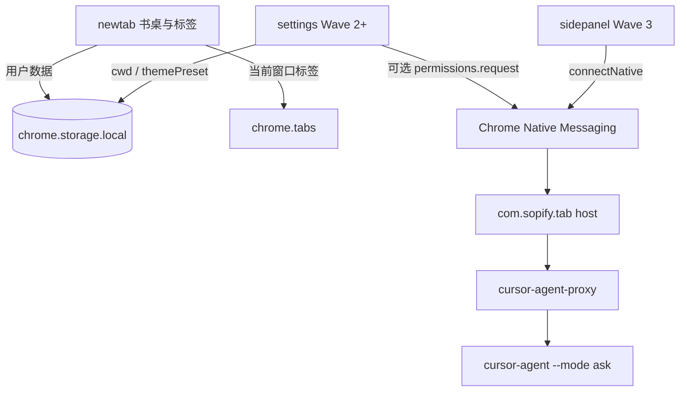

# 技术设计: Sopify Tab 工作台与可选本机 CLI

## 技术方案

- 核心技术: Chrome Manifest V3，Vanilla HTML / CSS / JavaScript；native host 用 Node，由 install 脚本写入绝对路径
- 实现要点:
  - `prototype/index.html` 只提供栏、卡片、日/夜 token。演示器边界见 `plan.md` Context。
  - Wave 1 的 newtab 只有书桌和标签。Wave 2 加设置页；`nativeMessaging` 仍是点连接后才申请。Agent 会话只活在 Wave 3 的 Side Panel 文档里。
  - 用户书桌数据只写 `chrome.storage.local`。当前窗口标签用 `chrome.tabs` 现查。当次对话只在 Side Panel 内存。
  - `nativeMessaging` 可选。商店包不带 host。Host JSON 的 `allowed_origins` 只列本扩展稳定 ID。
  - Host 入口必须是可执行文件的绝对路径。本机 `cursor-agent` 是 zsh alias，真实入口是 `/Users/weixin.li/.local/bin/cursor-agent-proxy`。禁止 `/usr/bin/env node`。
  - CLI 合同：`--print --output-format stream-json --mode ask`。cwd 锁定。不传 `--force`。不传模型选择。`--mode ask` 不是 OS 沙箱。
  - 关闭 Side Panel：结束 `Port`，并杀掉 host 拉起的整棵进程树。

## 架构设计



目录约定：

```text
sopify-tab/
  extension/     MV3 扩展
  host/          native host 与 install-host.sh
  prototype/     HTML 演示，视觉参考
  .sopify/       方案与长期知识
```

消费边界：

- `newtab.*`：书桌和标签。读 `storage.local` 和 `tabs`。Wave 1 不持有会话，不申请 `nativeMessaging`，不渲染 Host 状态。
- 设置页（Wave 2）：Host 说明与 `cwd`。检测失败只留在本页。Wave 4 加「外观」一块（`themePreset`）。
- `sidepanel.*`（Wave 3）：当次会话 DOM。关文档即停当次运行。不把对话写入 `storage`。
- `background.js`（Wave 3）：sidePanel 行为、消息转发。不在 service worker 里硬撑长任务，不当书桌数据库。
- `host/`：只在用户安装后存在于本机。不存放常用站、待办、便签。

`chrome.storage.local` 键：

```text
sites:  [{name, url}]          Wave 1
todos:  [{id, text, done}]     Wave 1
notes:  string                 Wave 1
name:   string                 Wave 1
cwd:    string                 Wave 2，默认 ""
themePreset: system|day|night  Wave 4，默认 system；不进 sync
```

不设 `skyPref`、`cli`、`model`。标签、Host 探测结果、对话消息不落盘。

## 安全与性能

- 安全: 稳定扩展 ID；host 白名单；可选权限；只读 ask；锁 cwd；不覆盖他人 native host；listing 不把聊天说成必装。书桌数据不出扩展、不上云、不经 Host。
- 性能: 第一屏不读 history / bookmarks；无常驻 sidecar；关侧栏释放进程。天空由外观预设驱动（默认跟随系统），样式参考演示，不验收云层和星空动画。
