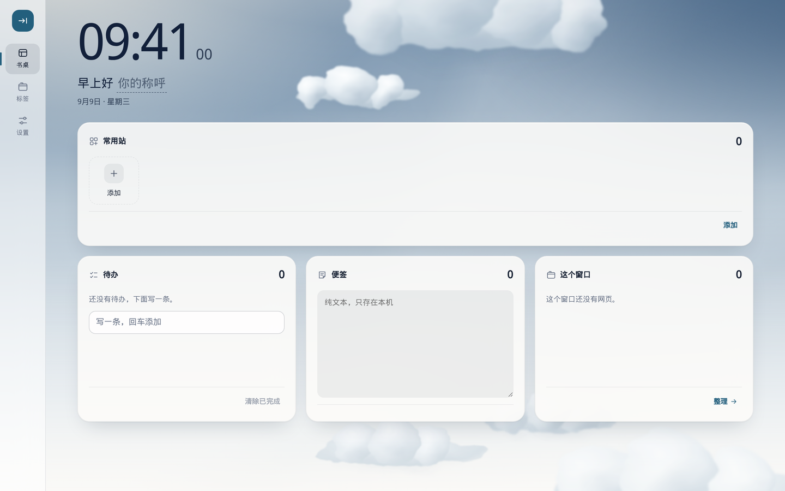
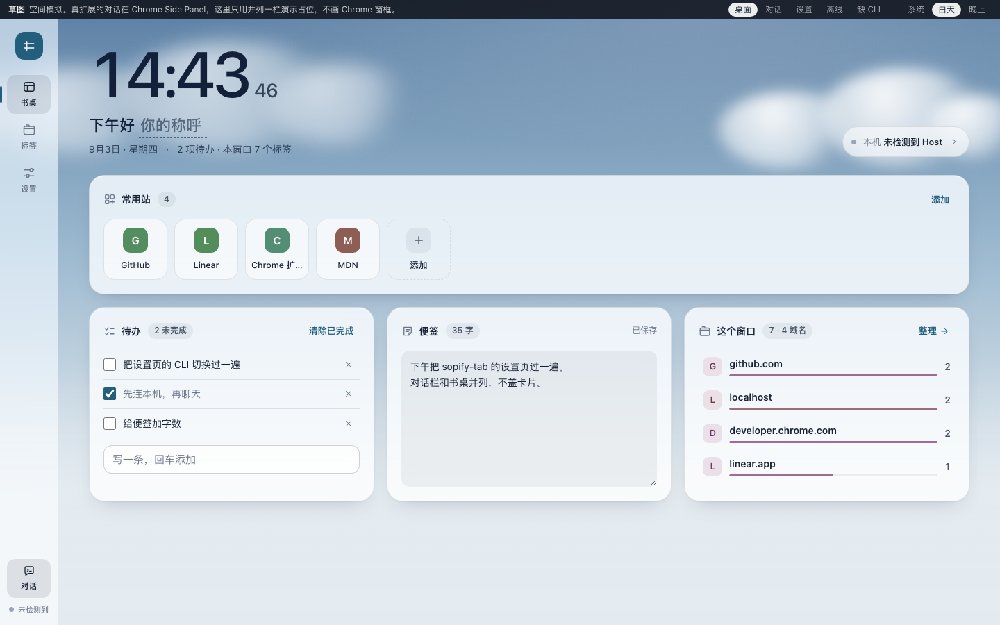
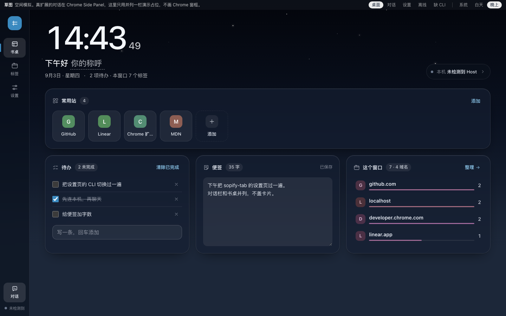

# Sopify Tab



打开新标签页，先是一张安静书桌。

雾更深，玻璃更静。

 

## 快速开始

```text
1. chrome://extensions
2. 打开「开发者模式」
3. 「加载已解压的扩展程序」→ extension/
4. 打开新标签页
```

稳定 ID：`cgkhllpelkjmfamddkjpnmchjikdcbgp`。权限见「隐私」。

## 功能

- **W1** 常用站、待办、便签、这个窗口
- **W2** 设置；Host 可选，书桌不依赖
- **W3** Side Panel 只读 ask · `./host/install-host.sh`
- **W4** 跟随系统 / 白天 / 夜晚
- **W6** Claude 只读（设置深路径）；默认 Cursor
- **W10** Codex 只读（设置深路径）

## 非目标

天气、番茄钟、壁纸商店、任意 Agent、未接线 CLI、可写执行、云同步、Agent Pocket、组件墙。

## 隐私

权限：`storage`、`tabs`、`sidePanel`。常用站、待办、便签、称呼、外观、上游选择只在本机 `chrome.storage.local`。标签现查，对话不落盘。无账号、无云同步。连 Host 才申请 `nativeMessaging`。出站跟本机环境（如 `HTTP_PROXY`）；扩展无代理设置。

## 路线图

W1–W4、W6、W9、W10 已落地。商店上架（W5）暂停。

## 许可

[MIT](LICENSE) · [`.sopify/blueprint/`](.sopify/blueprint/)
