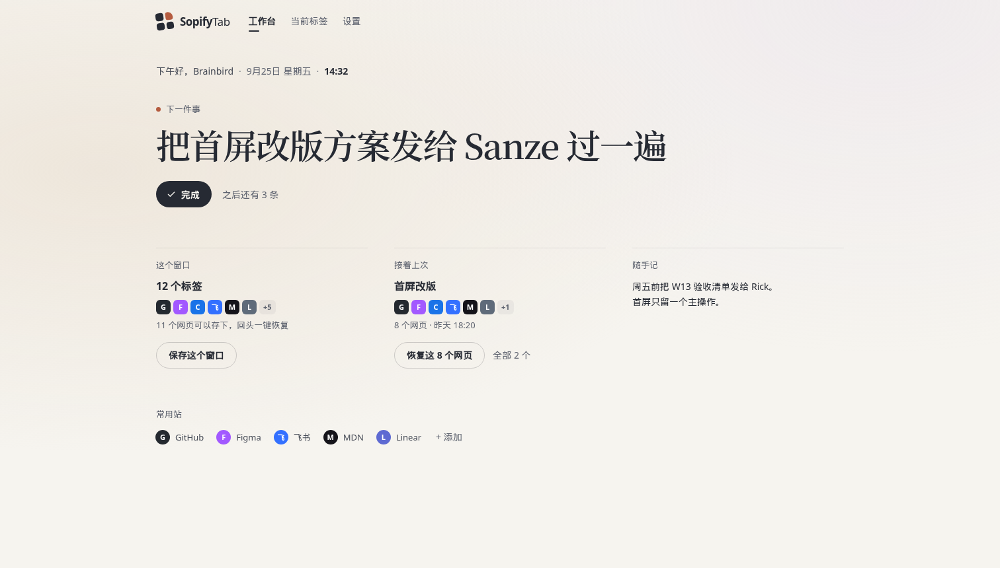

# Sopify Tab

安静的 Chrome 新标签页工作台。打开先看到「下一件事」。



## 做什么

默认首屏，从上到下：

- **下一件事**：第一条未完成待办。没有时在这里写下句，不拿标签或便签凑数。
- **这个窗口**：当前窗口里的网页。关掉一组时，按你此刻看得到的数量来说；没关掉的会明说，不会当成已经关掉。
- **接着上次**：最近一份存下的窗口，可以改名，也可以恢复。更多份在设置里。
- **随手记**：首屏直接写，自动存在本机。另一页同时在改时，两边全文都看得见，再由你选。存上了才说「已存在本机」；没存上会说明白，并留着你刚写的。过期的成功或冲突提示，不会把画面倒回旧的一版。
- **常用站**：排在三栏下面。没有照片墙。

**空间视图（实验）**在设置里打开，默认关着。关着时不加载三维；打开后才出现在常用站下方。恢复只补上还没打开的网页。

待办、常用站、存下的窗口，在另一页同时改时，两边的这次操作都会留下，不会整表互相盖掉。同一条没存上的待办再提交，不会变成两条；两句一样的字仍可以各留一条。一时读不出来时，不当成清空，可以重试；读成功之前，不会用空列表盖掉原有内容。

## 快速开始

品牌版 Google Chrome 用「加载已解压的扩展程序」。不要依赖 `--load-extension`。

1. 打开 `chrome://extensions`，打开「开发者模式」。
2. 点「加载已解压的扩展程序」，选择本仓库的 `extension/`（目录里有 `manifest.json`，不要选仓库根目录）。
3. 确认卡片名称是「Sopify Tab」。
4. 按 Ctrl/Cmd+T 打开新标签页，应先看到「下一件事」。

稳定扩展 ID：`cgkhllpelkjmfamddkjpnmchjikdcbgp`。

## 隐私与权限

必选权限：`storage`、`tabs`、`sidePanel`。没有别的强制权限。`nativeMessaging` 只在你要连接可选的本机对话时才申请。

没有账号，没有云同步。数据留在本机浏览器里。当前窗口的网页只在打开时查看，不会自动存下来。

存下的窗口只在你点「保存这个窗口」时写入，只留标题和网址。最多 5 个，每个最多 50 个网页。存满时会先问要不要覆盖。关窗口不会自动存。

## 可选：本机对话

在「设置 → 高级 → 连接本机」。没装 Host，书桌照常使用。默认只读：不是本地模型，不能写盘、执行，也不能传 `--force`。对话内容不落盘。需要时再装 Host，见 [`host/install-host.sh`](host/install-host.sh)。

## 非目标

天气、番茄钟、壁纸商店、云同步、Agent Pocket、未接线的 CLI、可写执行、组件墙、书签或历史聚类。Chrome 网上应用店上架暂缓。

## 开发者验证

可选，一条命令：

```bash
bash scripts/test-reliability.sh
```

替身和静态检查不等于真扩展通过。真扩展请用上面的「加载已解压」自己看一遍。真双页扩展、系统中文输入法、三维便签运行时、Host 全量，都不在这条命令的保证里。

## 许可

[MIT](LICENSE) · [`.sopify/blueprint/`](.sopify/blueprint/)
